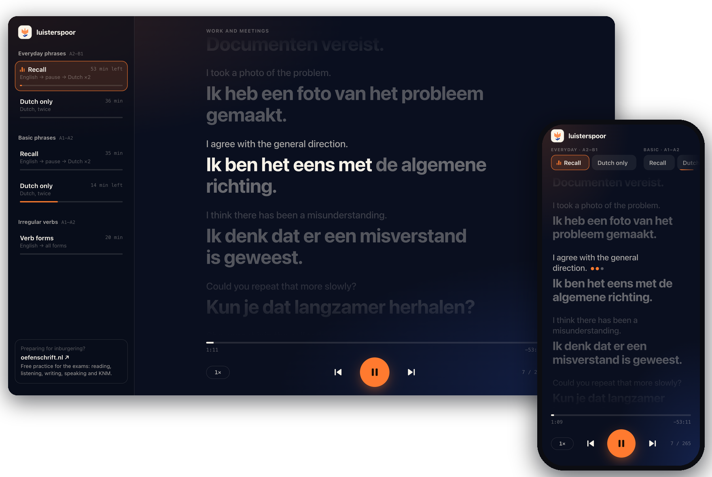

<h1 align="center">luisterspoor</h1>

  Dutch listening practice for walks, commutes and chores. 
  <a href="https://evgeny.io/projects/luisterspoor/"><b>Open the app →</b></a>

You hear an everyday phrase in English, get three seconds to say it in Dutch yourself, then hear the Dutch twice. The words light up as they are spoken, so when you do look at the screen you can read along.

| Track | Level | What you hear |
| --- | --- | --- |
| Everyday phrases | A2–B1 | 265 phrases. Recall (English, pause, Dutch ×2) or Dutch only |
| Basic phrases | A1–A2 | 200 phrases. Recall or Dutch only |
| Irregular verbs | A1–A2 | 75 verbs, each with its present, past and participle forms |

- **Works offline.** Add it to the home screen; after the first visit the audio stays on the device.
- **Picks up where you stopped**, per track. The lock screen shows the current phrase, and ⏮ ⏭ move between phrases.
- **Keyboard:** space plays and pauses, ← → change the phrase, − + change the speed.

## How it's made

Plain HTML, CSS and JavaScript, no build step. The phrases are written by hand, voiced with ElevenLabs and mixed into one MP3 per track with a JSON file of timings, in a separate workspace that packages this repository. A push to `main` deploys to [evgeny.io/projects/luisterspoor](https://evgeny.io/projects/luisterspoor/) with GitHub Actions.

To run it locally: `python3 -m http.server 8788`, then open http://127.0.0.1:8788/.

Preparing for the inburgering exams? [oefenschrift.nl](https://oefenschrift.nl/) has free practice for reading, listening, writing, speaking and KNM.
